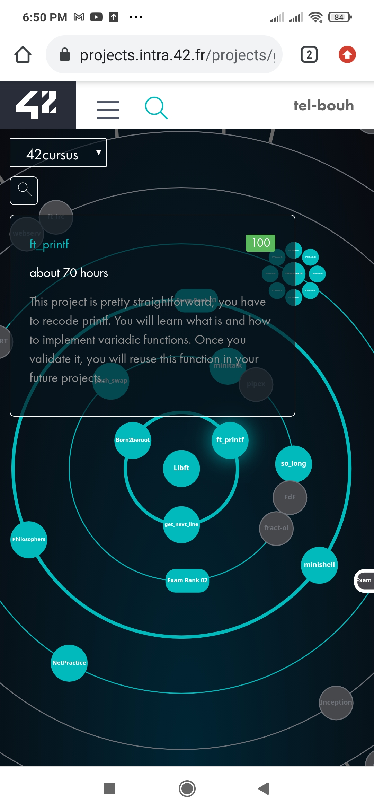

#Ft_printf: the Third pjoject in 42 cursus.

## Table of contents

- [Ft_printf-printf](#42-cursus)
  - [Table of contents](#table-of-contents)
  - [Overview](#overview)
  - [The project](#the-project)
  - [Screenshot](#screenshot)

## Overview
The aim of this project is to recode C printf function.

### The project

- This project is pretty straight forward. You will recode printf. Fortunetaly
you will be able to reuse it in future projects as a legit function of your libft. You will
mainly learn how to use variadic arguments.

### Screenshot

